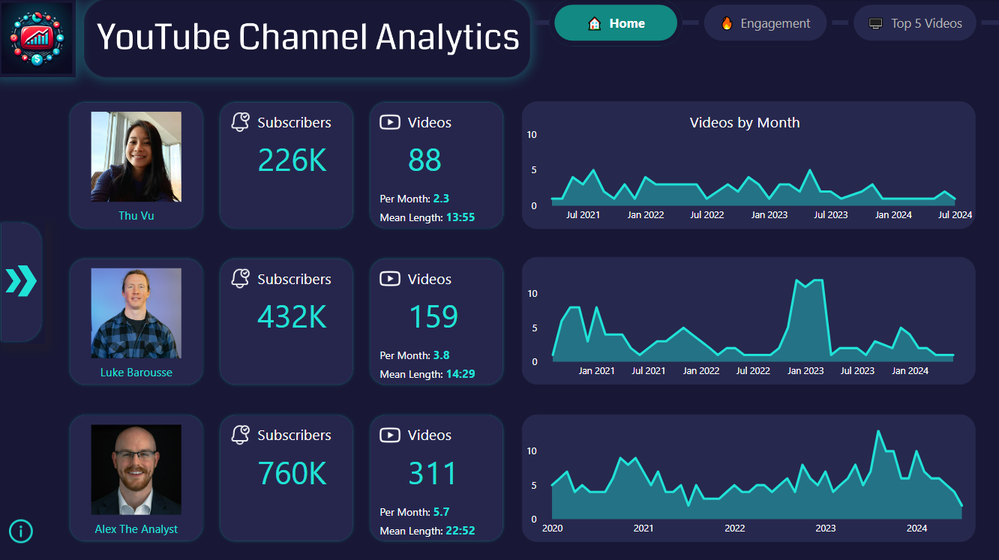
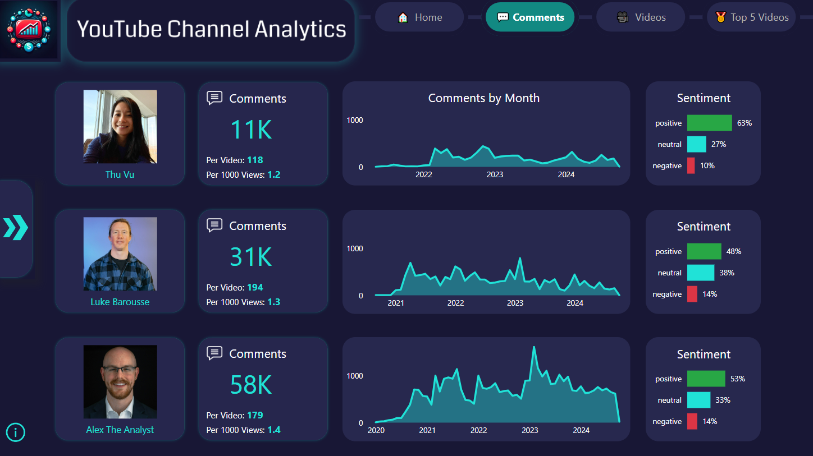
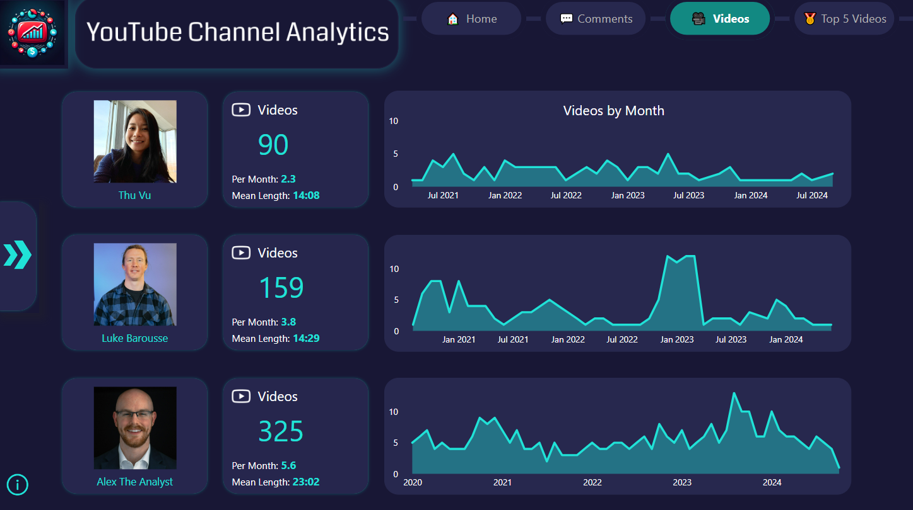
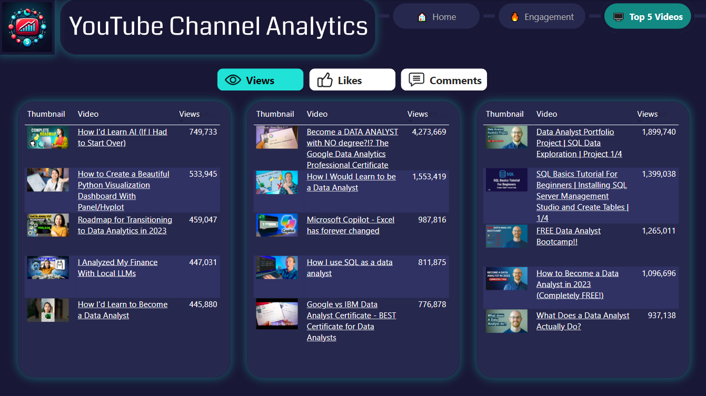

<!-- anchor tag for back-to-top links -->
<a name="readme-top"></a>

<!-- PROJECT LOGO -->
<div align="center">
  <a href="https://github.com/JensBender/youtube-channel-analytics">
    
  </a>
  <a href="https://github.com/JensBender/youtube-channel-analytics">
    
  </a>
  <p>
    <br />
    Empower YouTubers with actionable insights into channel performance relative to similar channels using an automated ETL pipeline and an interactive Power BI report for comparative analysis of key performance metrics.
    <br />
  </p>
</div> 

---

<!-- TABLE OF CONTENTS -->
## 📋 Table of Contents
<ol>
  <li>
    <a href="#-summary">Summary</a>
    <ul>
      <li><a href="#️-built-with">Built With</a></li>
    </ul>
  </li>
  <li>
    <a href="#-motivation">Motivation</a>
  </li>
  <li>
    <a href="#-etl-pipeline">ETL Pipeline</a>
  </li>
  <li>
    <a href="#-data-visualization">Data Visualization</a>
  </li>
  <li>
    <a href="#️-getting-started">Getting Started</a>
  </li>
  <li>
    <a href="#️-license">License</a>
  </li>
  <li>
    <a href="#️-credits">Credits</a>
  </li>
</ol>


<!-- SUMMARY -->
## 🎯 Summary
To empower YouTube content creators and marketers with actionable insights into their channel's performance, especially in comparison to related channels, I developed a comprehensive **ETL pipeline** and designed an interactive **Power BI report**. This project involved:

+ **Data Extraction**: Utilized the YouTube API to gather extensive data from three selected channels, including videos and comments.
+ **Data Transformation**: Performed sentiment analysis on video comments via API requests to a RoBERTa sentiment analysis model, which I deployed using Gradio on a private Hugging Face Space.
+ **Data Loading**: Stored the transformed data in a MySQL database hosted on AWS.
+ **Automation**: Managed the ETL workflow using Apache Airflow, Docker, and AWS.
+ **Data Visualization**: Designed an interactive Power BI report to deliver insigths into channel performance, featuring key metrics and comparative analysis. 

This project enables YouTube content creators to easily monitor and evaluate their channel's performance relative to their peers, allowing for more informed decision-making and strategic planning.

### 🛠️ Built With
* [![Python][Python-badge]][Python-url]
* [![Pandas][Pandas-badge]][Pandas-url]
* [![MySQL][MySQL-badge]][MySQL-url]
* [![Airflow][Airflow-badge]][Airflow-url]
* [![Docker][Docker-badge]][Docker-url]
* [![AWS][AWS-badge]][AWS-url]
* [![Hugging Face][HuggingFace-badge]][HuggingFace-url]
* [![Gradio][Gradio-badge]][Gradio-url]
* [![Power BI][PowerBI-badge]][PowerBI-url]
* [![Visual Studio Code][VisualStudioCode-badge]][VisualStudioCode-url]
* [![Jupyter Notebook][JupyterNotebook-badge]][JupyterNotebook-url]

<p align="right">(<a href="#readme-top">back to top</a>)</p>


<!-- MOTIVATION -->
## 💡 Motivation
+ **Problem**:  Analyzing and comparing the performance of multiple YouTube channels is crucial for content creators and marketers. Most available tools focus on single-channel analytics, making it difficult to perform comparisons with similar YouTube channels. Additionally, understanding audience sentiment towards content is often overlooked, despite its significant impact on channel growth and engagement.
+ **Project Goal**: Empower content creators and marketers with insights into a YouTube channel's performance and audience sentiment to enable informed decision-making and content optimization strategies. This is achieved by developing an automated ETL pipeline and by providing insightful visualizations.

<p align="right">(<a href="#readme-top">back to top</a>)</p>


<!-- ETL PIPELINE -->
## 🔄 ETL Pipeline
Built using Apache Airflow to automate the extraction, transformation, and loading of data from multiple YouTube channels.
+ **Data Extraction**: Utilized the YouTube API to gather comprehensive data from three selected channels, including video metadata, view counts, likes, comments, and more.
+ **Data Transformation**: Performed sentiment analysis on video comments using a [RoBERTa model](https://huggingface.co/cardiffnlp/twitter-roberta-base-sentiment-latest), featuring 125 million parameters, trained on ~124 million tweets and fine-tuned using the TweetEval benchmark. Deployed the model on a private Hugging Face Space using Gradio and integrated it into the ETL pipeline via API requests.
+ **Data Loading**: Stored the transformed data in a MySQL database hosted on an AWS RDS instance, ensuring persistent storage and facilitating easy access for comparative analysis.
+ **Automation**: Orchestrated the ETL workflow using Apache Airflow with Docker, hosted on an AWS EC2 t2.micro instance.

  

<p align="right">(<a href="#readme-top">back to top</a>)</p>


<!-- DATA VISUALIZATION -->
## 📊 Data Visualization
Created an interactive Power BI report offering in-depth insights into channel performance and audience engagement. The report queries data directly from the MySQL database hosted on AWS RDS, ensuring that the visualizations are always based on the most up-to-date information.

**Home Page**: Provides a comprehensive overview, including total subscribers, views, likes, and averages per video and per 1000 views. Users can easily compare multiple channels side-by-side to understand channel performance across key metrics relative to their peers. Users can also filter data by specific time periods.

  

**Comments Page**: Shows total comments, per-video and per-1000-view averages, monthly trends, and sentiment analysis. Users can select time periods for granular analysis.

  

**Videos Page**: Displays total video counts, average videos uploaded per month, average video length, and monthly upload trends over time. Like other pages, time period filtering is available, facilitating a deeper understanding of content production. 

  

**Top 5 Videos Page**: Ranks each channel's top 5 videos based on views, likes, or comments with clickable video links, enabling a tailored exploration of high-performing content. 

  

The report enables users to navigate interactively through metrics and time periods to discover trends in channel performance and audience engagement.

<p align="right">(<a href="#readme-top">back to top</a>)</p>


<!-- GETTING STARTED -->
## 🚀 Getting Started
Follow these instructions to set up and run the project on an **AWS EC2** instance. This guide will cover everything from launching your EC2 instance to connecting Power BI to your MySQL database on AWS RDS.

### Prerequisites
Before you begin, ensure you have the following in place:

- **AWS EC2 instance**: Amazon Linux 2 (t2.micro)
- **AWS RDS instance**: MySQL database
- **PuTTY SSH Client**: To connect to EC2 and set up an SSH tunnel
- **Docker**: Installed on the EC2 instance
- **Apache Airflow**: Installed on the EC2 instance
- **Power BI Desktop**: Installed on your local machine 

---

### Set Up Airflow with Docker on AWS 

#### 1. **Launch EC2 Instance**  
- Go to the [AWS Management Console](https://aws.amazon.com/console/) and create a new EC2 instance.
  - Select **Amazon Linux 2** as the OS.
  - Choose the **t2.micro** instance type for free-tier eligibility.
- Configure **Security Groups** to allow the following:  
  - **SSH (port 22)** from your local machine’s IP address to connect via SSH.
  - **Airflow Webserver (port 8080)** from your local IP address to access the Airflow Webserver UI.
  - **MySQL (port 3306)** to connect from the EC2 instance to the RDS instance.
  - **Outbound HTTP (port 80)** and **HTTPS (port 443)** to all IP addresses to download packages and updates.

#### 2. **Set Up MySQL on AWS RDS**
- Go to the [AWS RDS Console](https://aws.amazon.com/rds/) and create a MySQL instance.
  - Choose the **Free Tier** option (`db.t2.micro`).
  - Ensure **public accessibility** is set to **No** for added security (you’ll use the SSH tunnel for access).
  - Name your database `youtube_analytics`.
  - Save the **RDS endpoint**, **username**, and **password** for later use.
- Configure RDS **Security Groups**:  
  - Ensure your RDS security group allows inbound connections on **port 3306** from the EC2 instance's security group.

#### 3. **Connect to EC2 via SSH**
**Using PuTTY** (or your preferred SSH client):  
- **Host Name**: `<your-ec2-public-ip-address>`  
- **Port**: `22`  
- **Authentication**: Use your `.ppk` private key file for the EC2 instance.

**Set Up SSH Tunnel** for RDS Access:  
- In PuTTY, go to **Connection > SSH > Tunnels**.
  - **Source Port**: `3306` (MySQL)
  - **Destination**: `<your-rds-endpoint>:3306`
  - Click **Add**, then **Open** to establish the connection.
- This will forward traffic from your local machine (via port 3306) to the RDS instance through the EC2 instance.

#### 4. **Install Docker and Apache Airflow**
**Install Docker**:  Once connected to your EC2 instance, run the following commands to install Docker.
```bash
sudo yum update -y
sudo amazon-linux-extras install docker
sudo service docker start
sudo usermod -a -G docker ec2-user
```

**Install and Start Apache Airflow**: Execute the provided `airflow_start_ec2.sh` script to install and start Airflow.
```bash
./airflow_start_ec2.sh
```

---

### Set Up Power BI 
Once the SSH tunnel is up, you can connect Power BI to your RDS MySQL database.
- Open **Power BI Desktop**: Go to the **Home** tab and select **Get Data** > **MySQL database**.
- Configure the MySQL Connection:  
  - **Server**: `localhost:3308` (this points to your local machine, connected to the RDS via SSH tunnel on port 3308).
  - **Database**: `youtube_analytics`.
  - **Username**: Your RDS MySQL username.
  - **Password**: Your RDS MySQL password.

---

### Additional Tips
- **Airflow Web UI**: After starting Airflow on EC2, you can access the web UI by visiting `http://<your-ec2-public-ip>:8080` in your browser (ensure port 8080 is open in your security group).
- **RDS Connection**: You can use the same SSH tunnel setup to connect to your RDS instance using any MySQL client (e.g., MySQL Workbench) on `localhost:3308`.

<p align="right">(<a href="#readme-top">back to top</a>)</p>


<!-- LICENSE -->
## ©️ License
This project is licensed under the [MIT License](LICENSE).

<p align="right">(<a href="#readme-top">back to top</a>)</p>


<!-- CREDITS -->
## 👏 Credits
This project was made possible with the help of the following resources and tutorials:
+ **Project Logo**: Created using AI technology by [Microsoft Copilot](https://play.google.com/store/apps/details?id=com.microsoft.copilot&pcampaignid=web_share).
+ **YouTube API**: Tutorials by [Corey Schafer](https://www.youtube.com/watch?v=th5_9woFJmk) and [Thu Vu data analytics](https://www.youtube.com/watch?v=D56_Cx36oGY).
+ **Apache Airflow**: Tutorials by [coder2j](https://www.youtube.com/watch?v=z7xyNOF8tak&list=PLwFJcsJ61oujAqYpMp1kdUBcPG0sE0QMT) and [Data with Marc](https://www.youtube.com/watch?v=vEApEfa8HXk&list=PL79i7SgJCJ9hf7JgG3S-3lOpsk2QCpWkD).
+ **ETL Pipeline Flowchart**: Created using [draw.io](https://app.diagrams.net/).
+ **Power BI**: Tutorials by [BI Elite](https://www.youtube.com/@BIElite) and [How to Power BI](https://www.youtube.com/@HowtoPowerBI).
+ **Power BI Icons**: Attributions for icons used in the report.
  + <a href="https://www.flaticon.com/free-icons/eye" title="eye icons">Eye icons created by Kiranshastry - Flaticon</a>
  + <a href="https://www.flaticon.com/free-icons/like" title="like icons">Like icons created by logisstudio - Flaticon</a>
  + <a href="https://www.flaticon.com/free-icons/comment" title="comment icons">Comment icons created by Freepik - Flaticon</a>
  + <a href="https://www.flaticon.com/free-icons/youtube" title="youtube icons">YouTube icons created by Freepik - Flaticon</a>
  + <a href="https://www.flaticon.com/free-icons/subscribe" title="subscribe icons">Subscribe icons created by Komar Dews - Flaticon</a>
  + <a href="https://www.flaticon.com/free-icons/information" title="information icons">Information icons created by Freepik - Flaticon</a>

<p align="right">(<a href="#readme-top">back to top</a>)</p>


<!-- MARKDOWN LINKS -->
[Python-badge]: https://img.shields.io/badge/python-3670A0?style=for-the-badge&logo=python&logoColor=ffdd54
[Python-url]: https://www.python.org/
[Pandas-badge]: https://img.shields.io/badge/pandas-%23150458.svg?style=for-the-badge&logo=pandas&logoColor=white
[Pandas-url]: https://pandas.pydata.org/
[MySQL-badge]: https://img.shields.io/badge/mysql-4479A1.svg?style=for-the-badge&logo=mysql&logoColor=white 
[MySQL-url]: https://www.mysql.com/
[Airflow-badge]: https://img.shields.io/badge/Apache%20Airflow-017CEE?style=for-the-badge&logo=Apache%20Airflow&logoColor=white
[Airflow-url]: https://airflow.apache.org/
[Docker-badge]: https://img.shields.io/badge/docker-%230db7ed.svg?style=for-the-badge&logo=docker&logoColor=white
[Docker-url]: https://www.docker.com/
[AWS-badge]: https://img.shields.io/badge/AWS-%23FF9900.svg?style=for-the-badge&logo=amazon-aws&logoColor=white
[AWS-url]: https://aws.amazon.com/
[HuggingFace-badge]: https://img.shields.io/badge/Hugging%20Face-ffcc00?style=for-the-badge&logo=huggingface&logoColor=black
[HuggingFace-url]: https://huggingface.co/
[Gradio-badge]: https://img.shields.io/badge/Gradio-fc7404?style=for-the-badge&logoColor=white
[Gradio-url]: https://gradio.app
[PowerBI-badge]: https://img.shields.io/badge/power_bi-F2C811?style=for-the-badge&logo=powerbi&logoColor=black
[PowerBI-url]: https://www.microsoft.com/en-us/power-platform/products/power-bi
[VisualStudioCode-badge]: https://img.shields.io/badge/Visual%20Studio%20Code-0078d7.svg?style=for-the-badge&logo=visual-studio-code&logoColor=white
[VisualStudioCode-url]: https://code.visualstudio.com/
[JupyterNotebook-badge]: https://img.shields.io/badge/Jupyter-F37626.svg?style=for-the-badge&logo=Jupyter&logoColor=white
[JupyterNotebook-url]: https://jupyter.org/