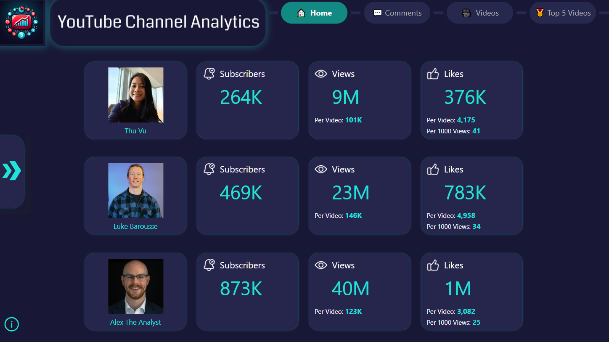
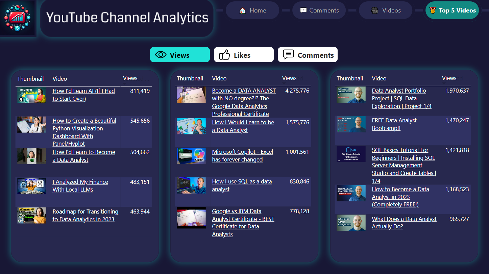

<!-- anchor tag for back-to-top links -->

<!-- PROJECT LOGO -->

  
  
  

     
    Empower YouTubers with actionable insights into channel performance relative to similar channels using an automated ETL pipeline for data collection. Visualize key performance metrics and conduct comparative analysis through an interactive Power BI report.
     
  

 

---

<!-- TABLE OF CONTENTS -->
## 📋 Table of Contents
<ol>
  <li>
    <a href="#-summary">Summary</a>
    <ul>
      <li><a href="#️-built-with">Built With</a></li>
    </ul>
  </li>
  <li>
    <a href="#-motivation">Motivation</a>
  </li>
  <li>
    <a href="#-etl-pipeline">ETL Pipeline</a>
  </li>
  <li>
    <a href="#-data-visualization">Data Visualization</a>
  </li>
  <li>
    <a href="#️-license">License</a>
  </li>
  <li>
    <a href="#️-credits">Credits</a>
  </li>
</ol>

<!-- SUMMARY -->
## 🎯 Summary
To empower YouTube content creators and marketers with actionable insights into their channel's performance, especially in comparison to related channels, I developed a comprehensive **ETL pipeline** and designed an interactive **Power BI report**. This project involved:

+ **Data Extraction**: Utilized the YouTube API to gather extensive data from three selected channels, including videos and comments.
+ **Data Transformation**: Performed sentiment analysis on video comments via API requests to a RoBERTa sentiment analysis model, which I deployed using Gradio on a private Hugging Face Space.
+ **Data Loading**: Stored the transformed data in a MySQL database hosted on AWS.
+ **Automation**: Managed the ETL workflow using Apache Airflow, Docker, and AWS.
+ **Data Visualization**: Designed an interactive Power BI report to deliver insigths into channel performance, featuring key metrics and comparative analysis. 

This project enables YouTube content creators to easily monitor and evaluate their channel's performance relative to their peers, allowing for more informed decision-making and strategic planning.

### 🛠️ Built With
* [![Python][Python-badge]][Python-url]
* [![Pandas][Pandas-badge]][Pandas-url]
* [![MySQL][MySQL-badge]][MySQL-url]
* [![Airflow][Airflow-badge]][Airflow-url]
* [![Docker][Docker-badge]][Docker-url]
* [![AWS][AWS-badge]][AWS-url]
* [![Hugging Face][HuggingFace-badge]][HuggingFace-url]
* [![Gradio][Gradio-badge]][Gradio-url]
* [![Power BI][PowerBI-badge]][PowerBI-url]
* [![Visual Studio Code][VisualStudioCode-badge]][VisualStudioCode-url]
* [![Jupyter Notebook][JupyterNotebook-badge]][JupyterNotebook-url]

(<a href="#readme-top">back to top</a>)

<!-- MOTIVATION -->
## 💡 Motivation
+ **Problem**:  Analyzing and comparing the performance of multiple YouTube channels is crucial for content creators and marketers. Most available tools focus on single-channel analytics, making it difficult to perform comparisons with similar YouTube channels.
+ **Project Goal**: Empower content creators and marketers with insights into a YouTube channel's performance to enable informed decision-making and content optimization strategies by developing an automated ETL pipeline and providing insightful visualizations.

(<a href="#readme-top">back to top</a>)

<!-- ETL PIPELINE -->
## 🔄 ETL Pipeline
Built using Apache Airflow to automate the extraction, transformation, and loading of data from multiple YouTube channels.
+ **Data Extraction**: Utilized the YouTube API to gather comprehensive data from three selected channels, including video metadata, view counts, likes, comments, and more.
+ **Data Transformation**: Implemented data manipulation and transformation techniques using Pandas to prepare the extracted data for analysis.
+ **Data Loading**: Stored the transformed data in a MySQL database hosted on an AWS RDS instance, ensuring persistent storage and facilitating easy access for comparative analysis.
+ **Automation**: Orchestrated the ETL workflow using Apache Airflow with Docker, hosted on an AWS EC2 t2.micro instance.

  

(<a href="#readme-top">back to top</a>)

<!-- DATA VISUALIZATION -->
## 📊 Data Visualization
Created an interactive Power BI report with multiple pages designed to offer in-depth insights into channel performance and audience engagement. The report queries data directly from the MySQL database hosted on AWS RDS, ensuring that the visualizations are always based on the latest available data.

**Home Page**: Provides an overview with subscriber counts, video metrics, and area charts showing videos by month. Users can select time periods and compare channels side-by-side for a comprehensive analysis. 
  

**Engagement Page**: Visualizes key engagement metrics such as views, likes, and comments. Includes per-video and per-1000-views averages, complemented by area charts tracking monthly comment trends. 
  

**Top 5 Videos Page**: Highlights each channel's top 5 videos, with user-defined ranking criteria (views, likes, or comments) and clickable video links, enabling a tailored exploration of high-performing content. 
  
The report facilitates an interactive exploration of various metrics, allowing users to easily navigate through time periods and metrics to uncover patterns and trends in channel performance and audience behavior.

(<a href="#readme-top">back to top</a>)

<!-- LICENSE -->
## ©️ License
This project is licensed under the [MIT License](LICENSE).

(<a href="#readme-top">back to top</a>)

<!-- CREDITS -->
## 👏 Credits
This project was made possible with the help of the following resources and tutorials:
+ **Project logo**: Created using AI technology by [Microsoft Copilot](https://play.google.com/store/apps/details?id=com.microsoft.copilot&pcampaignid=web_share).
+ **YouTube API**: Tutorials by [Corey Schafer](https://www.youtube.com/watch?v=th5_9woFJmk) and [Thu Vu data analytics](https://www.youtube.com/watch?v=D56_Cx36oGY).
+ **Apache Airflow**: Tutorials by [coder2j](https://www.youtube.com/watch?v=z7xyNOF8tak&list=PLwFJcsJ61oujAqYpMp1kdUBcPG0sE0QMT) and [Data with Marc](https://www.youtube.com/watch?v=vEApEfa8HXk&list=PL79i7SgJCJ9hf7JgG3S-3lOpsk2QCpWkD).
+ **Power BI**: Tutorials by [BI Elite](https://www.youtube.com/@BIElite) and [How to Power BI](https://www.youtube.com/@HowtoPowerBI).
+ **Power BI icons**: Attributions for icons used in the report.
  + <a href="https://www.flaticon.com/free-icons/eye" title="eye icons">Eye icons created by Kiranshastry - Flaticon</a>
  + <a href="https://www.flaticon.com/free-icons/like" title="like icons">Like icons created by logisstudio - Flaticon</a>
  + <a href="https://www.flaticon.com/free-icons/comment" title="comment icons">Comment icons created by Freepik - Flaticon</a>
  + <a href="https://www.flaticon.com/free-icons/youtube" title="youtube icons">Youtube icons created by Freepik - Flaticon</a>
  + <a href="https://www.flaticon.com/free-icons/subscribe" title="subscribe icons">Subscribe icons created by Komar Dews - Flaticon</a>
  + <a href="https://www.flaticon.com/free-icons/information" title="information icons">Information icons created by Freepik - Flaticon</a>

(<a href="#readme-top">back to top</a>)

<!-- MARKDOWN LINKS -->
[Python-badge]: https://img.shields.io/badge/python-3670A0?style=for-the-badge&logo=python&logoColor=ffdd54
[Python-url]: https://www.python.org/
[Pandas-badge]: https://img.shields.io/badge/pandas-%23150458.svg?style=for-the-badge&logo=pandas&logoColor=white
[Pandas-url]: https://pandas.pydata.org/
[MySQL-badge]: https://img.shields.io/badge/mysql-4479A1.svg?style=for-the-badge&logo=mysql&logoColor=white 
[MySQL-url]: https://www.mysql.com/
[Airflow-badge]: https://img.shields.io/badge/Apache%20Airflow-017CEE?style=for-the-badge&logo=Apache%20Airflow&logoColor=white
[Airflow-url]: https://airflow.apache.org/
[Docker-badge]: https://img.shields.io/badge/docker-%230db7ed.svg?style=for-the-badge&logo=docker&logoColor=white
[Docker-url]: https://www.docker.com/
[AWS-badge]: https://img.shields.io/badge/AWS-%23FF9900.svg?style=for-the-badge&logo=amazon-aws&logoColor=white
[AWS-url]: https://aws.amazon.com/
[HuggingFace-badge]: https://img.shields.io/badge/Hugging%20Face-ffcc00?style=for-the-badge&logo=huggingface&logoColor=black
[HuggingFace-url]: https://huggingface.co/
[Gradio-badge]: https://img.shields.io/badge/Gradio-fc7404?style=for-the-badge&logoColor=white
[Gradio-url]: https://gradio.app
[PowerBI-badge]: https://img.shields.io/badge/power_bi-F2C811?style=for-the-badge&logo=powerbi&logoColor=black
[PowerBI-url]: https://www.microsoft.com/en-us/power-platform/products/power-bi
[VisualStudioCode-badge]: https://img.shields.io/badge/Visual%20Studio%20Code-0078d7.svg?style=for-the-badge&logo=visual-studio-code&logoColor=white
[VisualStudioCode-url]: https://code.visualstudio.com/
[JupyterNotebook-badge]: https://img.shields.io/badge/Jupyter-F37626.svg?style=for-the-badge&logo=Jupyter&logoColor=white
[JupyterNotebook-url]: https://jupyter.org/